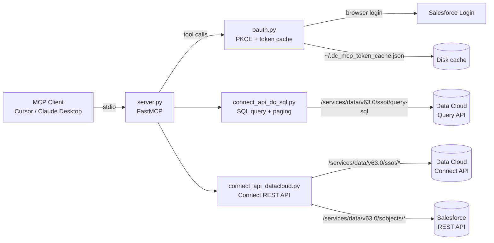

# Data Cloud MCP

A Model Context Protocol (MCP) server for **Salesforce Data Cloud** that exposes 30+ tools to LLM clients like Cursor, Claude Desktop, and any other MCP-compatible host. Query Data Cloud with SQL, manage data streams, browse the data model, create segments and calculated insights, and more — all from a chat prompt.

---

## Features

- **SQL query** against Data Cloud (PostgreSQL dialect, paginated, long-poll for long-running queries)
- **Data stream management** — list, inspect, refresh, create, delete; works with SalesforceDotCom, S3, GCS, Azure, SFTP, MuleSoft, IngestApi connectors
- **Data model exploration** — list DMOs, describe fields, view stream-to-DMO mappings, identity rulesets
- **Segments** — list, create from JSON definition or DBT-style SQL
- **Calculated insights** — list, create from SQL expression
- **Data graphs** — list, create with nested relationships, delete
- **Retrievers & search indexes** — for AI / RAG use cases
- **Generic Salesforce REST** — `sf_rest_api`, `describe_sobject`, `create_sobject_record` for anything not covered by a dedicated tool
- **OAuth2 PKCE** flow with browser-based login and on-disk token cache (`~/.dc_mcp_token_cache.json`)

---

## Prerequisites

- Python **3.10+** (3.13 recommended)
- A Salesforce org with **Data Cloud enabled** and a user that has Data Cloud admin / query permissions
- Ability to create a **Connected App** in that org

---

## Quick start

### 1. Clone and install

```bash
git clone https://github.com/rishiganesh25/data360-mcp.git
cd data360-mcp
pip install -r requirements.txt
```

### 2. Create a Connected App in your org

Follow [CONNECTED_APP_SETUP.md](CONNECTED_APP_SETUP.md). Required OAuth scopes:

- `api` — REST API access
- `cdp_query_api` — Data Cloud query
- `cdp_profile_api` — Data Cloud profile / Connect API
- `refresh_token` — keep the session alive

Make sure **PKCE is required** and the **Callback URL** is `http://localhost:55556/Callback` (port 55556 — do **not** use 55555). Note the **Consumer Key** and **Consumer Secret**.

### 3. Configure credentials

```bash
cp .env.example .env
# edit .env and paste your Consumer Key and Secret
```

### 4. Wire it into your MCP client

#### Cursor

Open **Cursor Settings → MCP → Add new global MCP server** (or edit `~/.cursor/mcp.json` directly):

```json
{
  "mcpServers": {
    "datacloud": {
      "command": "python",
      "args": ["/absolute/path/to/data360-mcp/server.py"],
      "env": {
        "SF_CLIENT_ID": "<your Consumer Key>",
        "SF_CLIENT_SECRET": "<your Consumer Secret>",
        "SF_LOGIN_URL": "login.salesforce.com"
      },
      "disabled": false,
      "autoApprove": ["list_tables", "describe_table", "list_data_streams", "list_data_model_objects"]
    }
  }
}
```

Replace `python` with the absolute path returned by `which python` if your Cursor doesn't pick up your shell's Python. Use `test.salesforce.com` as `SF_LOGIN_URL` for sandboxes.

#### Claude Desktop

Edit `~/Library/Application Support/Claude/claude_desktop_config.json` (macOS) or `%APPDATA%\Claude\claude_desktop_config.json` (Windows):

```json
{
  "mcpServers": {
    "datacloud": {
      "command": "python",
      "args": ["/absolute/path/to/data360-mcp/server.py"],
      "env": {
        "SF_CLIENT_ID": "<your Consumer Key>",
        "SF_CLIENT_SECRET": "<your Consumer Secret>"
      }
    }
  }
}
```

### 5. First run

Restart your MCP client. The first tool call opens a browser for OAuth login — sign in with the Salesforce user that should run the queries. The token is cached to `~/.dc_mcp_token_cache.json` (~110-minute lifetime, then auto-refreshed via the same flow).

---

## Tool catalog

### Query & schema

| Tool | Purpose |
|---|---|
| `query` | Execute a SQL query (PostgreSQL dialect) against Data Cloud. Returns `{data, metadata}`. Handles long-running queries via long-polling and paginates results. |
| `list_tables` | List queryable tables. Filter prefix configurable via `DEFAULT_LIST_TABLE_FILTER`. |
| `describe_table` | Return the column list of a given table. |

### Data streams

| Tool | Purpose |
|---|---|
| `list_data_streams` | All data streams with status, source, last-refresh date. |
| `get_data_stream_info` | Detailed config + mappings for a single stream (by API name). |
| `refresh_stream` | Trigger a refresh on a stream. |
| `create_new_data_stream` | Create a new stream from any connector type (SalesforceDotCom, AmazonS3, GCS, Azure, SFTP, MuleSoft, IngestApi, etc.). |
| `create_ingestion_schema` | Define field schema for an Ingestion API stream. |
| `delete_stream` | Delete a stream (and optionally its underlying DLO). |
| `list_available_connectors` | List all configured connectors (use before `create_new_data_stream`). |
| `list_connector_objects` | List source objects available within a specific connector. |
| `list_connected_source_objects` | List source objects already wired to a stream (avoids duplicates). |

### Data model

| Tool | Purpose |
|---|---|
| `list_data_model_objects` | All DMOs in the org. |
| `get_dmo_details` | Field metadata + relationships for a specific DMO (e.g. `ssot__Individual__dlm`). |
| `list_mappings` | All data-stream-to-DMO mappings. |
| `list_identity_rulesets` | All identity-resolution rulesets. |

### Segments

| Tool | Purpose |
|---|---|
| `list_segments` | All segments. |
| `create_segment` | Create from a full JSON segment definition. |
| `create_segment_dbt` | Create a DBT (SQL-based) segment from a SELECT statement. |

### Calculated insights

| Tool | Purpose |
|---|---|
| `list_calculated_insights` | All CIs. |
| `create_calculated_insight` | Create a CI from a SQL expression (with dimensions/measures inferred). |

### Data graphs

| Tool | Purpose |
|---|---|
| `list_data_graphs` | All data graphs. |
| `create_data_graph` | Build a graph rooted at a primary DMO with nested related-object specs. |
| `delete_data_graph` | Delete by developer name. |

### Retrievers & search

| Tool | Purpose |
|---|---|
| `list_retrievers` | All Data Cloud retrievers (system + custom). |
| `list_search_indexes` | All semantic-search indexes. |

### Generic Salesforce REST

| Tool | Purpose |
|---|---|
| `sf_rest_api` | Generic GET/POST/PATCH/DELETE against any `/services/data/...` path. |
| `describe_sobject` | Return field metadata for any sObject. |
| `create_sobject_record` | Create an arbitrary sObject record. |

---

## Configuration reference

| Env var | Required | Default | Notes |
|---|---|---|---|
| `SF_CLIENT_ID` | yes | — | Consumer Key from your Connected App. |
| `SF_CLIENT_SECRET` | yes | — | Consumer Secret. |
| `SF_LOGIN_URL` | no | `login.salesforce.com` | Use `test.salesforce.com` for sandboxes. |
| `SF_CALLBACK_URL` | no | `http://localhost:55556/Callback` | Must exactly match the Connected App's Callback URL. |
| `DEFAULT_LIST_TABLE_FILTER` | no | `%` | SQL LIKE pattern for `list_tables`. |

---

## Architecture



---

## Examples

The [examples/](examples/) folder contains standalone scripts that use the same OAuth + Connect API helpers (count active streams, dump org metadata, etc.). Useful for smoke-testing your Connected App outside of an MCP client.

---

## Troubleshooting

| Problem | Fix |
|---|---|
| `Address already in use` on port 55556 | Another process holds the port. Kill it (`lsof -i :55556`) or change `SF_CALLBACK_URL` and the Connected App's Callback URL to a free port (avoid 55555). |
| `invalid_client_id` after login | The `SF_CLIENT_ID` env var doesn't match a Connected App in the org you logged into. Verify the Consumer Key and which org/sandbox you're hitting via `SF_LOGIN_URL`. |
| `403 Forbidden` from Data Cloud APIs | The user that logged in via OAuth doesn't have Data Cloud permissions. Assign the `Customer Data Platform Admin` (or equivalent) permission set. |
| `OAuth scopes missing` / `cdp_query_api not enabled` | Edit the Connected App and add the `cdp_query_api` and `cdp_profile_api` scopes (full list above). Save, wait ~10 min for propagation. |
| Tools not showing up in Cursor | Click the refresh icon in the MCP settings. Check `command` resolves to a Python with `mcp[cli]` installed (run `python -m mcp --version` in a shell). |
| Token expired / `401 Unauthorized` mid-session | Delete `~/.dc_mcp_token_cache.json` and trigger a tool call to re-auth. |

---

## Contributing

See [CONTRIBUTING.md](CONTRIBUTING.md). Bug reports and PRs welcome.

## License

[Apache License 2.0](LICENSE.txt). See [SECURITY.md](SECURITY.md) for vulnerability disclosure.
