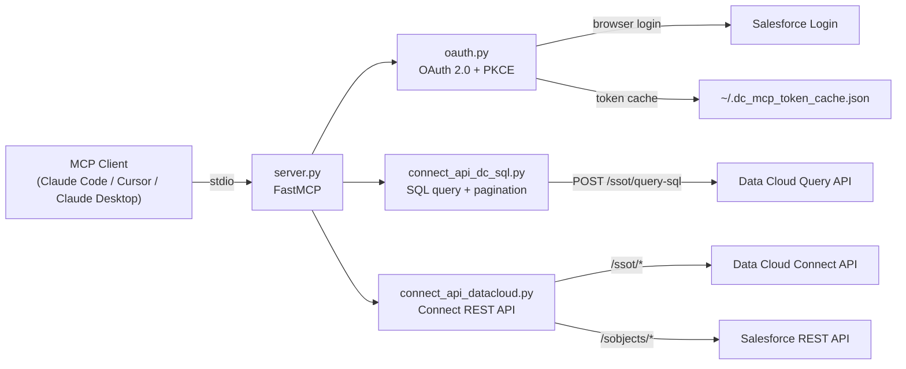

# FLASH

A Headless, API-Native & Agentic AI Framework for Salesforce Data360

FLASH is a headless, API-native, agentic AI framework that transforms how Salesforce Data360 Implementations are delivered and operated.
Built on the custom Model Context Protocol (MCP), FLASH exposes 60+ intelligent APIs and operational tools that allow AI agents to autonomously execute Data360 workflows through natural language — eliminating dependency on manual UI-driven configuration.
From ingestion and modeling to segmentation, querying, and insights generation, FLASH enables organizations to operate Salesforce Data360 through a scalable headless and agentic architecture, accessible from:

* Cursor 
* Claude Desktop 
* Agentforce Vibes
* Custom AI Agents 

FLASH creates a reusable AI execution layer that standardizes, accelerates, and simplifies Data 360 operations across the enterprise.


---

## Table of Contents

1. [Prerequisites](#prerequisites)
2. [Step-by-Step Setup](#step-by-step-setup)
3. [Verify It Works](#verify-it-works)
4. [Tool Catalog](#tool-catalog)
5. [Configuration Reference](#configuration-reference)
6. [Architecture](#architecture)
7. [Security](#security)
8. [Troubleshooting](#troubleshooting)

---

## Prerequisites

Before starting, make sure you have:

| Requirement | How to check | Install if missing |
|---|---|---|
| Python 3.10 or newer (3.13 recommended) | `python3 --version` | [python.org/downloads](https://www.python.org/downloads/) |
| pip (Python package manager) | `pip3 --version` | Comes with Python; or `python3 -m ensurepip` |
| git | `git --version` | [git-scm.com](https://git-scm.com/) |
| A Salesforce org with **Data Cloud enabled** | Setup > Data Cloud | Contact your Salesforce admin |
| A Salesforce user with Data Cloud permissions | — | Assign `Customer Data Platform Admin` permission set |

---

## Step-by-Step Setup

Follow these steps in order. The entire setup takes about 15 minutes.

---

### Step 1: Clone the Repository

```bash
git clone https://github.com/rishiganesh25/data360-mcp.git
cd data360-mcp
```

---

### Step 2: Create a Python Virtual Environment

```bash
python3 -m venv .venv
```

Activate it:

```bash
# macOS / Linux
source .venv/bin/activate

# Windows (PowerShell)
.\.venv\Scripts\Activate.ps1

# Windows (cmd)
.\.venv\Scripts\activate.bat
```

You should see `(.venv)` in your terminal prompt.

---

### Step 3: Install Dependencies

```bash
pip install -r requirements.txt
```

This installs the MCP SDK, requests, pydantic, and other required packages.

---

### Step 4: Verify the Server Can Start

```bash
python server.py
```

You should see `Starting MCP server` in the output. Press `Ctrl+C` to stop it. This confirms your Python environment is set up correctly.

---

### Step 5: Enable External Client Apps in Salesforce

1. Log in to your Salesforce org
2. Click the **gear icon** (top right) > **Setup**
3. In the **Quick Find** box (left sidebar), type: `External Client Apps`
4. Click **Settings** under "External Client Apps"
5. Enable **both** toggles:
   - "Allow access to External Client App consumer secrets via REST API"
   - "Allow creation of connected apps"
6. Click **Save**

---

### Step 6: Create a Connected App

1. In Setup, navigate to **External Client Apps** (left sidebar)
2. Click **New Connected App**
3. Fill in the basic information:

| Field | Value |
|---|---|
| Connected App Name | `Data Cloud MCP` |
| API Name | `Data_Cloud_MCP` (auto-populated) |
| Contact Email | Your email address |

4. Click **Next** or scroll down to the API section

---

### Step 7: Configure OAuth on the Connected App

1. Check the box: **"Enable OAuth Settings"**

2. Set the **Callback URL** to exactly:
   ```
   http://localhost:55556/Callback
   ```
   > **Warning**: Do NOT use port `55555` — it conflicts with macOS AirPlay Receiver and other services.

3. Add the following **OAuth Scopes** (click "Add" for each one):

   | Scope to select | What it enables |
   |---|---|
   | `Access the identity URL service (id, profile, email, address, phone)` | User identity during OAuth |
   | `Manage user data via APIs (api)` | General Salesforce REST API access |
   | `Manage Data Cloud profile data (cdp_profile_api)` | Data Cloud Connect API (streams, segments, graphs) |
   | `Perform ANSI SQL queries on Data Cloud data (cdp_query_api)` | SQL queries against Data Cloud tables |
   | `Perform requests at any time (refresh_token, offline_access)` | Keeps sessions alive without re-login |

4. Under **Security Settings**, enable all three:

   | Setting | Value |
   |---|---|
   | Require Secret for Web Server Flow | **Yes** (checked) |
   | Require Secret for Refresh Token Flow | **Yes** (checked) |
   | Require Proof Key for Code Exchange (PKCE) | **Yes** (checked) |

5. Click **Save**

---

### Step 8: Configure OAuth Policies

1. On your Connected App page, click **Manage** (button at the top)
2. Click **Edit Policies**
3. Under **OAuth Policies**, find **IP Relaxation** and change it to:
   ```
   Relax IP restrictions
   ```
4. Click **Save**

> **Why?** Without this, Salesforce blocks OAuth from `localhost` because it doesn't match any trusted IP range. The PKCE flow still requires browser login, so this is safe.

---

### Step 9: Copy Your Consumer Key and Secret

1. Go to **Setup** > search **"External Client Apps"** in Quick Find
2. Find **Data Cloud MCP** in the list and click on it
3. Navigate to: **Settings** > **OAuth Settings** > **App Settings**
4. Copy the **Consumer Key** — this becomes your `SF_CLIENT_ID`
5. Click "Click to reveal" next to Consumer Secret and copy it — this becomes your `SF_CLIENT_SECRET`

> **Important**: Keep these safe. You'll paste them in the next step. Never commit them to git.

> **Note**: Connected App changes can take 5-10 minutes to propagate. If you get errors in Step 12, wait and retry.

---

### Step 10: Configure Your Credentials

Back in your terminal, in the `data360-mcp` directory:

```bash
cp .env.example .env
```

Open `.env` in any text editor and paste your credentials:

```bash
# Required — paste the Consumer Key and Secret from Step 9
SF_CLIENT_ID=your_consumer_key_here
SF_CLIENT_SECRET=your_consumer_secret_here

# Optional — change only if needed
SF_LOGIN_URL=login.salesforce.com
SF_CALLBACK_URL=http://localhost:55556/Callback
```

**If you're using a sandbox**, change:
```bash
SF_LOGIN_URL=test.salesforce.com
```

**If you're using a My Domain org**, change:
```bash
SF_LOGIN_URL=your-company.my.salesforce.com
```

Then secure the file:

```bash
chmod 600 .env
```

---

### Step 11: Wire It Into Your MCP Client

Pick the MCP client you're using and follow the config below.

> In all examples, replace `/absolute/path/to/data360-mcp` with the **actual full path** where you cloned the repo (e.g., `/Users/yourname/projects/data360-mcp`).
>
> If you used a virtual environment (Step 2), replace `python` with `.venv/bin/python` in the command.

---

#### Option A: Claude Code (CLI or VS Code Extension)

Create or edit `.mcp.json` in your project root (or `~/.claude/mcp.json` for global access):

```json
{
  "mcpServers": {
    "datacloud": {
      "type": "stdio",
      "command": "bash",
      "args": [
        "-c",
        "set -a && source /absolute/path/to/data360-mcp/.env && set +a && cd /absolute/path/to/data360-mcp && .venv/bin/python server.py"
      ]
    }
  }
}
```

---

#### Option B: Cursor

Open **Cursor Settings > MCP > Add new global MCP server**, or edit `~/.cursor/mcp.json`:

```json
{
  "mcpServers": {
    "datacloud": {
      "command": "bash",
      "args": [
        "-c",
        "set -a && source /absolute/path/to/data360-mcp/.env && set +a && cd /absolute/path/to/data360-mcp && .venv/bin/python server.py"
      ],
      "disabled": false,
      "autoApprove": [
        "list_tables",
        "describe_table",
        "list_data_streams",
        "list_data_model_objects",
        "list_segments",
        "list_calculated_insights"
      ]
    }
  }
}
```

> **Tip**: `autoApprove` lists read-only tools that won't prompt for confirmation each time.

---

#### Option C: Claude Desktop

Edit your config file:

- **macOS**: `~/Library/Application Support/Claude/claude_desktop_config.json`
- **Windows**: `%APPDATA%\Claude\claude_desktop_config.json`

```json
{
  "mcpServers": {
    "datacloud": {
      "command": "bash",
      "args": [
        "-c",
        "set -a && source /absolute/path/to/data360-mcp/.env && set +a && cd /absolute/path/to/data360-mcp && .venv/bin/python server.py"
      ]
    }
  }
}
```

---

### Step 12: Authenticate (First Run)

1. **Restart your MCP client** (or reload/refresh the MCP server list)
2. **Ask it something** — for example: *"List all tables in Data Cloud"*
3. **A browser window will open** showing the Salesforce login page
4. **Sign in** with the Salesforce user that has Data Cloud permissions
5. **Authorize the app** when Salesforce asks "Allow access?"
6. The browser will show: **"You can close this window now"**
7. **Switch back to your MCP client** — the response should now appear

The access token is cached at `~/.dc_mcp_token_cache.json` and lasts ~110 minutes. When it expires, the browser login will open again automatically — no action needed from you.

---

## Verify It Works

Try these prompts in your MCP client to confirm everything is connected:

| Prompt to try | Expected result |
|---|---|
| *"List all tables in Data Cloud"* | Returns a list of table names (DMOs, DLOs, CIOs) |
| *"Show me all data streams and their status"* | Returns streams with Active/Inactive status |
| *"Describe the ssot__Individual__dlm table"* | Returns column names for the Individual DMO |
| *"How many segments do I have?"* | Returns a count and list of segment names |
| *"Run this SQL: SELECT COUNT(*) FROM ssot__Individual__dlm"* | Returns a row count |

If any of these fail, check the [Troubleshooting](#troubleshooting) section.

---

## Tool Catalog

### Query & Schema (3 tools)

| Tool | What it does |
|---|---|
| `query` | Execute SQL (PostgreSQL dialect) against Data Cloud. Handles long-running queries and pagination automatically. |
| `list_tables` | List all queryable tables. Filterable via `DEFAULT_LIST_TABLE_FILTER` env var. |
| `describe_table` | Get column names for a specific table. |

### Data Streams (6 tools)

| Tool | What it does |
|---|---|
| `list_data_streams` | All streams with status, source, category, and last refresh date. |
| `get_data_stream_info` | Detailed configuration for a single stream. |
| `refresh_stream` | Trigger a manual data refresh. |
| `create_new_data_stream` | Create a stream from any connector (CRM, S3, GCS, Azure, SFTP, MuleSoft, IngestApi). |
| `create_ingestion_schema` | Define the schema for an Ingestion API stream. |
| `delete_stream` | Remove a stream (and optionally its Data Lake Object). |

### Data Lake Objects (3 tools)

| Tool | What it does |
|---|---|
| `create_dlo` | Create a DLO with fields, category, and optional dataspace filters. |
| `update_dlo` | Update a DLO's label or add new fields. |
| `delete_dlo` | Delete a DLO by record ID or developer name. |

### Data Model Objects (5 tools)

| Tool | What it does |
|---|---|
| `list_data_model_objects` | All DMOs with metadata. |
| `get_dmo_details` | Fields and relationships for a specific DMO. |
| `create_custom_dmo` | Create a fully custom DMO with fields and category. |
| `create_custom_dmo_fields` | Add custom fields to an existing DMO. |
| `delete_custom_dmo_fields` | Delete custom fields from a DMO. |

### DLO-DMO Mappings (5 tools)

| Tool | What it does |
|---|---|
| `list_mappings` | All stream-to-DMO field mappings. |
| `create_dlo_dmo_mapping` | Create a mapping with pre-flight validation, auto PK/timestamp injection. |
| `update_dlo_dmo_mapping` | Update an existing mapping (delete + recreate). |
| `delete_dlo_dmo_mapping` | Delete a mapping by name or by source/target entity. |
| `batch_create_dlo_dmo_mappings` | Create multiple mappings in parallel (grouped by DLO to avoid lock contention). |

### Segments (5 tools)

| Tool | What it does |
|---|---|
| `list_segments` | All segments in the org. |
| `create_segment` | Create a segment from a JSON definition. |
| `create_segment_dbt` | Create a SQL-based segment (automatically discovers field API names). |
| `update_segment` | Update a segment (definition, schedule, description, etc.). |
| `delete_segment` | Delete a segment by API name. |

### Activations (4 tools)

| Tool | What it does |
|---|---|
| `list_activations` | All segment activations with pagination and ordering. |
| `get_activation_details` | Full details of a specific activation. |
| `update_activation` | Update activation settings (refreshType, filters, static data, etc.). |
| `delete_activation` | Delete an activation by ID. |

### Connectors (5 tools)

| Tool | What it does |
|---|---|
| `list_connectors` | All SSOT connectors (activation targets, marketing connectors). |
| `get_connector_metadata` | Metadata for a specific connector type. |
| `list_available_connectors` | Data source connectors configured in the org. |
| `list_connector_objects` | Source objects available in a connector. |
| `list_connected_source_objects` | Objects that already have streams (avoid duplicates). |

### Data Action Targets (4 tools)

| Tool | What it does |
|---|---|
| `list_data_action_targets` | All data action targets (S3, Marketing Cloud, webhook, etc.). |
| `get_data_action_target` | Details of a specific target by API name. |
| `create_data_action_target` | Create a target (Core, MarketingCloud, or WebHook). |
| `delete_data_action_target` | Delete a target by API name. |

### Data Actions (2 tools)

| Tool | What it does |
|---|---|
| `list_data_actions` | All data actions configured in Data Cloud. |
| `create_data_action` | Create a data action triggered by DMO record changes (CREATE/UPDATE/DELETE). |

### Data Spaces (5 tools)

| Tool | What it does |
|---|---|
| `list_data_spaces` | All data spaces. |
| `get_data_space` | Details of a specific data space by ID or name. |
| `update_data_space` | Update a data space's label and/or description. |
| `list_data_space_members` | All members (DMOs, DLOs, etc.) in a data space. |
| `get_data_space_member` | Details of a specific member in a data space. |

### Data Transforms (4 tools)

| Tool | What it does |
|---|---|
| `create_data_transform` | Create a transform (BATCH with STL nodes, or STREAMING with SQL). |
| `update_data_transform` | Full replacement update of a transform (PUT). |
| `delete_data_transform` | Delete a transform by name or ID. |
| `get_data_transform_run_history` | Run history with execution statuses and timestamps. |

### Calculated Insights (2 tools)

| Tool | What it does |
|---|---|
| `list_calculated_insights` | All calculated insights. |
| `create_calculated_insight` | Create a CI from a SQL SELECT expression with inferred dimensions/measures. |

### Data Graphs (4 tools)

| Tool | What it does |
|---|---|
| `list_data_graphs` | All data graph definitions. |
| `get_data_graphs_metadata` | Full metadata for all data graphs (structure, DMOs, relationships). |
| `create_data_graph` | Create a graph rooted at a primary DMO with nested relationships. |
| `delete_data_graph` | Delete a data graph by developer name. |

### Identity Resolution (1 tool)

| Tool | What it does |
|---|---|
| `list_identity_rulesets` | Identity resolution ruleset configuration. |

### Retrievers & Search (2 tools)

| Tool | What it does |
|---|---|
| `list_retrievers` | All retrievers (system + custom, for RAG use cases). |
| `list_search_indexes` | All semantic search index definitions. |

### Salesforce REST (3 tools)

| Tool | What it does |
|---|---|
| `sf_rest_api` | Make GET/POST/PATCH/DELETE calls to `/services/data/` and `/services/connect/` paths. |
| `describe_sobject` | Get field metadata for any Salesforce sObject. |
| `create_sobject_record` | Create a record on any sObject. |

---

## Configuration Reference

| Environment Variable | Required | Default | Description |
|---|---|---|---|
| `SF_CLIENT_ID` | Yes | — | Consumer Key from your Connected App |
| `SF_CLIENT_SECRET` | Yes | — | Consumer Secret from your Connected App |
| `SF_LOGIN_URL` | No | `login.salesforce.com` | Login host. Use `test.salesforce.com` for sandboxes or your My Domain. |
| `SF_CALLBACK_URL` | No | `http://localhost:55556/Callback` | Must match the Connected App's Callback URL exactly. |
| `DEFAULT_LIST_TABLE_FILTER` | No | `%` | SQL LIKE filter for `list_tables` (e.g., `ssot__%` for only standard DMOs). |

---

## Architecture



---

## Security

- **OAuth 2.0 with PKCE** — no long-lived credentials stored; tokens auto-expire in ~110 minutes
- **Token cache** is written with `0600` permissions (owner-read/write only)
- **Credentials in `.env`** — never committed to git (`.gitignore`'d)
- **`sf_rest_api`** is restricted to `/services/data/` and `/services/connect/` paths only; tooling, composite, and async-query endpoints are blocked
- **SQL input validation** — table names are validated against identifier patterns before use
- **Local transport only** — the server communicates via stdio (no network port exposed)

---

## Troubleshooting

| Problem | Cause & Fix |
|---|---|
| `Address already in use` on port 55556 | Another process is using that port. Run `lsof -i :55556` to find it and kill it, or change `SF_CALLBACK_URL` (and the Connected App) to a different port. |
| `invalid_client_id` after browser login | Your `SF_CLIENT_ID` doesn't match a Connected App in the org you're logging into. Double-check the Consumer Key and that `SF_LOGIN_URL` points to the correct org. Wait 10 minutes if you just created the app. |
| `redirect_uri_mismatch` | The Callback URL in the Connected App must be **exactly** `http://localhost:55556/Callback` (case-sensitive, no trailing slash). |
| `403 Forbidden` from Data Cloud APIs | The logged-in user doesn't have Data Cloud permissions. Assign the **Customer Data Platform Admin** permission set in Setup > Permission Sets. |
| `cdp_query_api not enabled` | The Connected App is missing required scopes. Edit it in Setup, add all 5 scopes from Step 7, save, and wait ~10 minutes for propagation. |
| Tools not showing in Cursor | Click the refresh/reload icon in Cursor MCP settings. Verify that `python` resolves to a Python with `mcp[cli]` installed (run `python -m mcp --version`). |
| `401 Unauthorized` mid-session | Token expired and auto-refresh failed. Delete `~/.dc_mcp_token_cache.json` and trigger any tool call to re-authenticate. |
| `ModuleNotFoundError: No module named 'mcp'` | Dependencies not installed. Run `pip install -r requirements.txt` in your activated venv. |
| Browser doesn't open for login | You're running in a headless/remote environment. Run the server on a machine with a browser, or pre-authenticate on a desktop machine first. |
| `Connection refused` in MCP client | The server isn't running or crashed on startup. Check the path in your MCP config and try `python server.py` manually to see error output. |
| `PKCE challenge failed` | Make sure "Require Proof Key for Code Exchange" is checked in the Connected App. If you changed it after creation, wait 10 minutes. |

---

## Examples

The [examples/](examples/) folder has standalone scripts using the same OAuth + API helpers:

```bash
# Count active data streams
python examples/count_streams.py

# Dump org DMO metadata
python examples/dump_metadata.py
```

Useful for verifying your Connected App works before wiring up an MCP client.

---

## Contributing

See [CONTRIBUTING.md](CONTRIBUTING.md). Bug reports and PRs welcome.

## License

[Apache License 2.0](LICENSE.txt). See [SECURITY.md](SECURITY.md) for vulnerability disclosure.
